### Inclusion

1. IIFE
2. Closures
3. Hoisting
4. Strict mode
5. This keyword
6. Bind method
7. Call method
8. Apply method
9. Catching, throw errors
10. Promise
11. Async function, await

---

### IIFE là gì?

- Immediately Invoked Function Expression
- hiểu đơn giản là hàm expression được gọi ngay lập tức
  > Self-Invoking Function
- toán tử () sau đó viết expression function trong đó thì nó sẽ thực thi luôn, thêm () để gọi hàm

1. IIFE trông thế nào?
2. Dùng dấu ; trước IIFE
3. IIFE là hàm "private"
4. Sử dụng IIFE khi nào?

- tạo ra phạm vi mới
- hầu hết code từ bên trong không ảnh hưởng đến dự án

5. Các cách tạo ra một IIFE

- Lưu ý: thêm toán tử + -... ở trước thì nó sẽ convert sang Boolean, trước khi convert sẽ thực thi mảng

6. Ví dụ sử dụng IIFE
   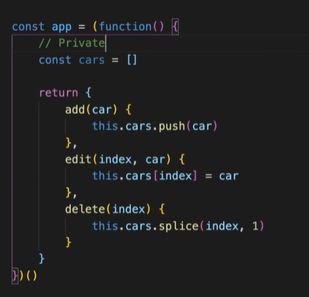

- cars có tính private gần tương tự như trong lập trình hướng đối tượng
  -> Không truy xuất trực tiếp được
- tức là chủ động public phương thức nào ra thì mới truy cập được -> ứng dụng không bị phá huỷ dễ dàng.

---

### Scope?

- Các loại phạm vi:
  - Global: toàn cầu
  - Code block - Khối mã: let, const
  - Local scope - Hàm: var, function
- Khi gọi mỗi lần hàm sẽ tạo ra phạm vi mới dù chung hàm
- Các hàm có thể truy cập các biến được khai báo trong phạm vi của nó và bên ngoài nó

- Khi nào một biến bị xoá khỏi bộ nhớ?

  - Biến toàn cầu?
    - Khi chương trình bị thoát
  - Biến trong code block & trong hàm?
  - Biến trong hàm được tham chiếu bởi 1 hàm?

- Cách thức một biến được truy cập
- Tìm gần nhất xem có biến đó hay không
- Ví dụ:
  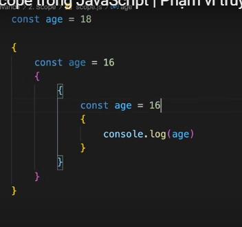
  -> không lỗi, do phạm vi khác nhau
  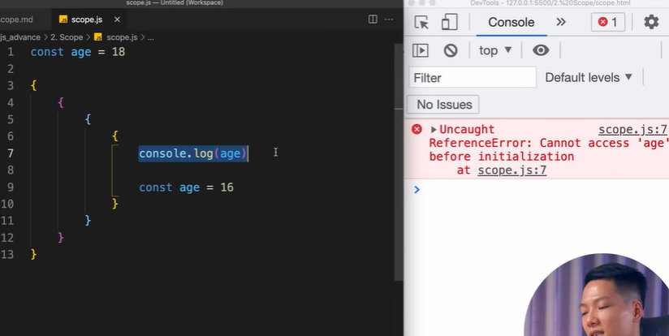
  -> nó sẽ thấy trong phạm vi có biến nào được tạo ra nó sẽ lấy, nhưng do không được khai báo nên nó lỗi, tương tự với let

---

### Khái niệm Closure?

- Tính khép kín, tính bao đóng của hàm trong JS

1. Closure

- là một hàm có thể ghi nhớ nơi nó được tạo ra và truy cập được biến ở bên ngoài phạm vi của nó
  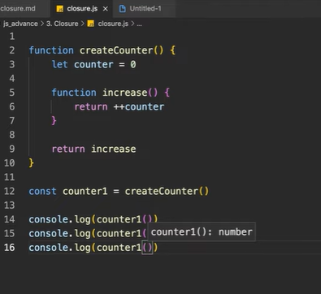
- Chỉ hàm createCounter nên có duy nhất 1 phạm vi được tạo ra
- counter gán bằng hàm increse
- counter1 được gọi lần thứ nhất nó lấy giá trị counter bên ngoài và cộng cộng lên bằng 1
- tương tự các lần gọi counter1, do nó nhớ môi trường nó được tạo ra, nên counter +1 =2
- counter trong hàm luôn tham chiếu đến giá trị bên ngoài

2. Ứng dụng

- Viết code ngắn gọn hơn
- Biểu diễn, ứng dụng tính Private trong OOP
- Ví dụ:
  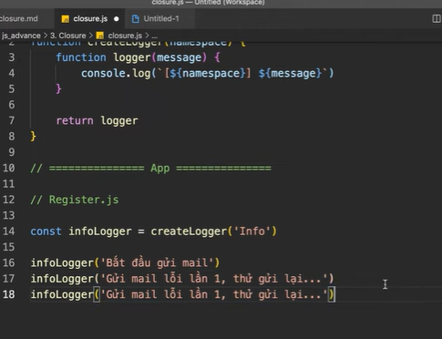
- Ví dụ lưu dữ liệu trong localStorage
  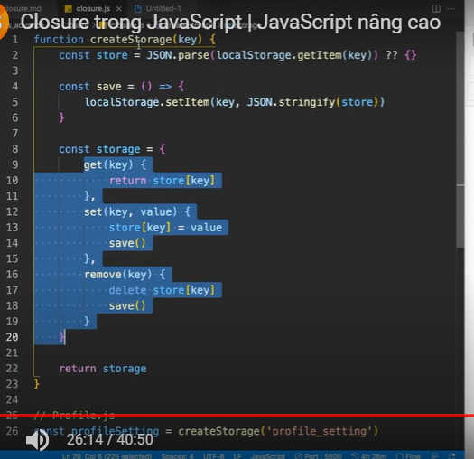

3. Lưu ý

- Biến được tham chiếu (refer) trong closure sẽ không được xoá khỏi bộ nhớ khi hàm cha thực thi xong
- Các khái niệm Javascript nâng cao rất dễ gây nhầm lẫn

---

# Hoisting, Strict Mode, Data Types

1. Hoisting là gì?

- Là việc đưa khai báo lên đầu phạm vi
- Hoisting với "var", "function declaration"
  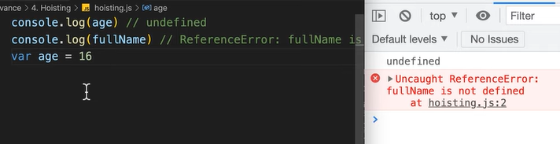
  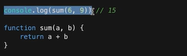
- Hoisting với "let", "const"
  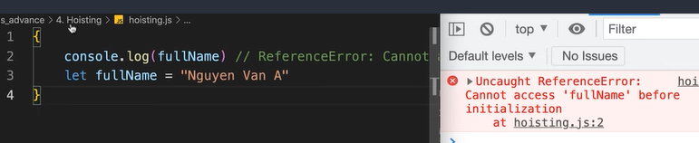
  - được hoist lên nhưng không khởi tạo được giá trị và được đưa vào "Temporal Dead Zone"
- Bài toán
  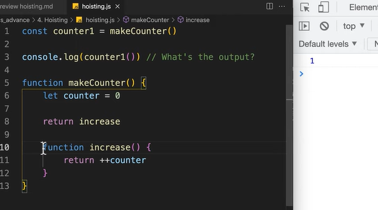

2. Strict mode

- Chế độ nghiêm ngặt, giúp code JS an toàn hơn
- Báo lỗi khi gán lại giá trị cho thuộc tính có writable: false
- Báo lỗi khi có hàm trùng tên
  - Ví dụ khi khai báo object dùng Object.freeze
- Xoá những thứ không được xoá
- Không đặt tên biến tên hàm bằng một số keyword đặc biệt

3. Data Types: Primitive Types & Reference Types

- Primitive data types (value types)
  - String
  - Number
  - Boolean
  - BigInt
  - Symbol
  - undefined
  - null
- Reference types (non-premitive data types)
  - Object
  - Array
  - Function
- Data types with functions
  - value types
  - refernce types
- Bài toán
  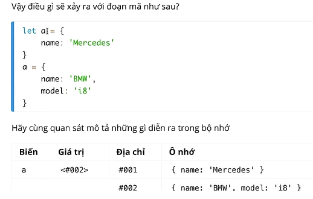

---

### 20/8/2024

---

# This, Bind, Call, Apply

---

### This?

- Trong hầu hết các trường hợp This trỏ vào đối tượng mà nó thuộc về
- Trường hợp ngoại lệ:
  - Trong hàm bình thường (không có đối tượng truy cập phương thức): this là window
    -> strict mode không cho phép
    - nếu truy cập hàm này qua đối tượng window, thì đối tượng sẽ là window (strict mode được phép)
- arrow function không có context => không có this
  -> trả ra this bên ngoài
  Lưu ý:

- this trong hàm tạo là đại diện cho đối tượng sẽ được tạo ra
- bind, call, apply có thể tham chiếu this đến các đối tượng khác

---

### Fn.bind() method

1. Part1

- mang ý nghĩa ràng buộc
- ràng buộc this trong hàm/phương thức
  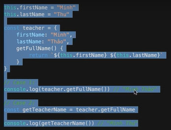
  - gọi biến đó không qua đối tượng, nên trả về đối tượng windows
- Khi gọi một hàm độc lập không qua đối tượng, nó sẽ trả về đối tượng toàn cục (windows)
- bind:

* ràng buộc với từ khoá this trong hàm teacher
  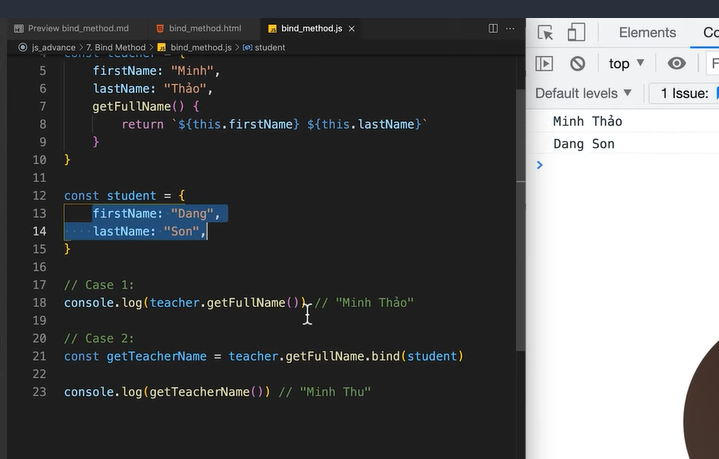

- Phương thức bind sẽ trả về một hàm mới với this
- Có thể nhận các tham số như hàm ban đầu
- giúp ràng buộc this trong hàm trong phương thức với this tuỳ ý
- lưu ý: nếu bind luôn đối số, thì đối số cứng không thể thay đổi khi gọi hàm
- Ví dụ
  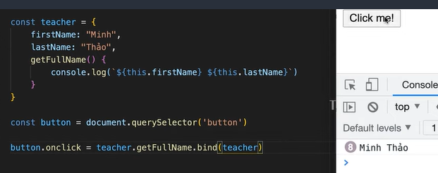

2. Part2
   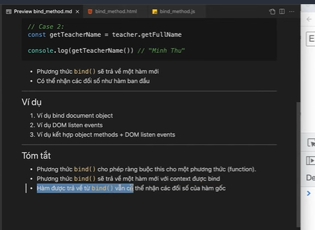

---

### Fn.call() method

console.dir(Function)-> xem các method

- call là một phương thức gọi hàm
- Bind this trước sau đó gọi luôn hàm đó
- Gọi hàm và bind this, lưu ý trong strict mode vẫn có this nếu được bind
- Thể hiện tính kế thừa (extends) trong OOP
- Mượn hàm, thêm ví dụ với arguments

---

### Fn.apply() method

- Phương thức này cho phép gọi một hàm với một this (bind) và truyền đối số cho hàm gốc dưới dạng mảng.

---

### So sánh bind, call, apply

1. Giống nhau

- Cú pháp truy cập
- Là các methods được kế thừa từ Function.prototype

2. Cách hoạt động

- Bind method:
  - Trả ra hàm mới với 'this' tham chiếu tới 'thisArg'
  - Không thực hiện gọi hàm
  - Nếu được bind kèm 'arg1,arg2,...' thì các đối số này sẽ được ưu tiên hơn
  - const newFn=fn.bind(thisArg, arg1, arg2, ...)
- Call method
  - Thực hiện bind 'this' với 'thisArg' và thực hiện gọi hàm
  - Nhận các đối số cho hàm gốc từ 'arg1,arg2, ...'
  - fnn.call(thisArg, arg1, arg2, ...)
- Apply
  - Thực hiện bind 'this' với 'thisArg' và thực hiện gọi hàm
  - Nhận các đối số cho hàm gốc bằng đối số thứ 2 dưới dạng mảng '[arg1, arg2, ...]'
  - fn.apply(thisArg,[arg1, arg2, ...])

### Conclusion

- Dúng bind khi muốn ràng buộc ngữ cảnh với một hàm bạn muốn gọi sau
- Dùng call hoặc apply nếu muốn bind và gọi ngay lập tức

---

### Additional

---

### Pass by value

- Đặc điểm: Gán lại tham số trong hàm, không làm thay đổi biến bên ngoài hàm

### Pass by reference

- Gán lại tham số trong hàm, ngay lập tức biến ngoài hàm cũng thay đổi

# Javascript chỉ là Pass by value

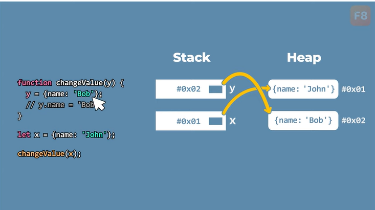
