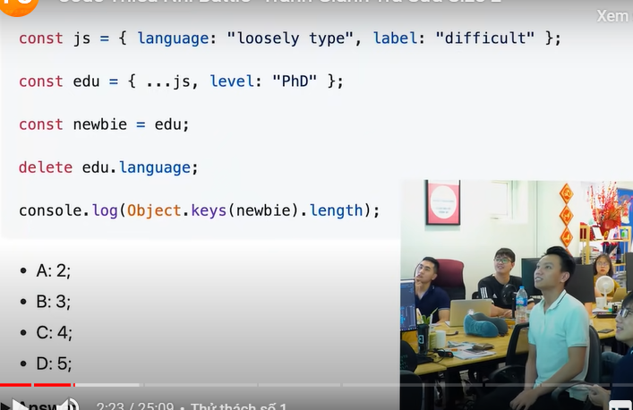
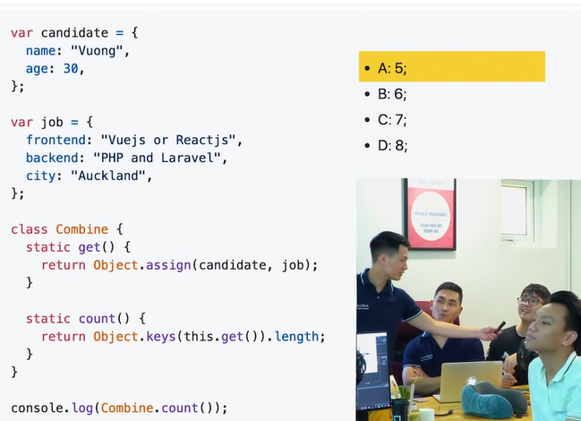
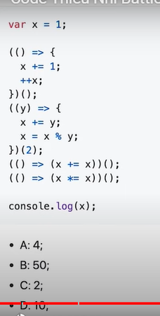
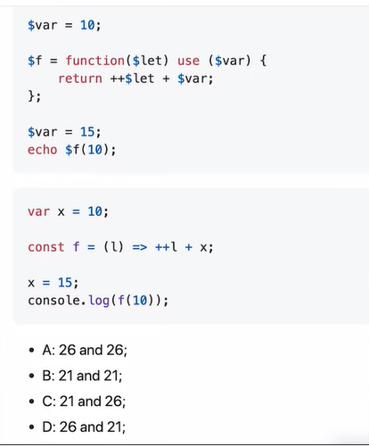
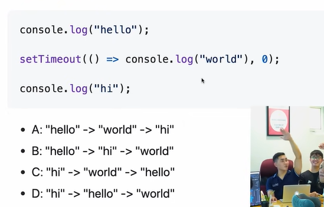
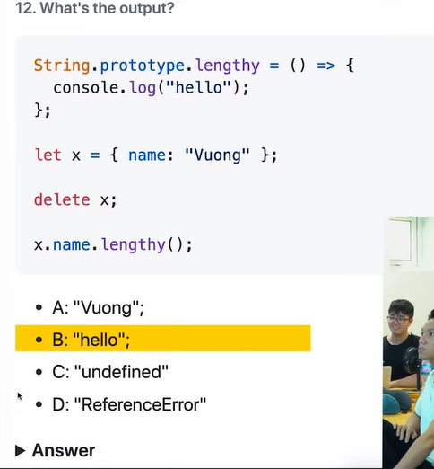
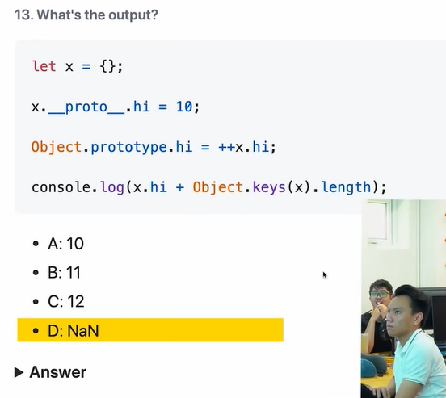

- 0.1 + 0.2 khác 0.3
- type of NaN
- Math.max() : - Infinity
- Math.min() : Infinity

---

### Part 2

- Đáp án: 2
  

- Đáp án: 5
  
- Đáp án: 4
  
- Đáp án: 26(Lưu ý chỉ care vế số 2)
  
- Đáp án: B. JS chạy đồng bộ, nó sẽ in hello. JS gặp settimeout là bất đồng bộ nó sẽ đưa vào web api để đợi và nó chạy hello trước, sau đó nó in ra hi world cuối cùng
  
- Đáp án: B. delete x không có phương thức xoá đối tượng x nên vẫn chạy bình thường.
  
- Đáp án: C.12. Tạo ra biến x là object, x.**proto** sẽ trỏ về constructor proto tạo ra nó. Object.prototype.hi giống vs x.**proto**.hi
  

---

### part 3

keyword search: javascript we trust github

- 14
