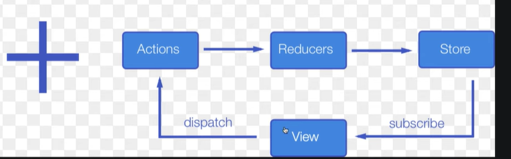

# React + Redux

---

### View

- Thành phần hiển thị giao diện người dùng

### Action

- Mô tả hành động

### Reducers

- Phân biệt hành động, hành động
- Update phần tử

### Store

- Update lại ra view

---
