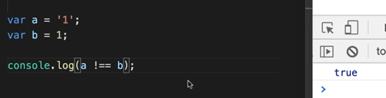
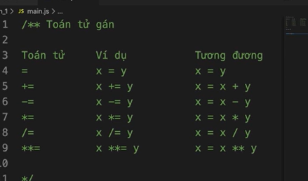
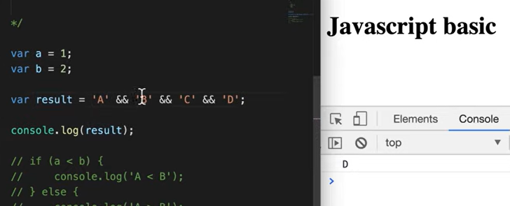
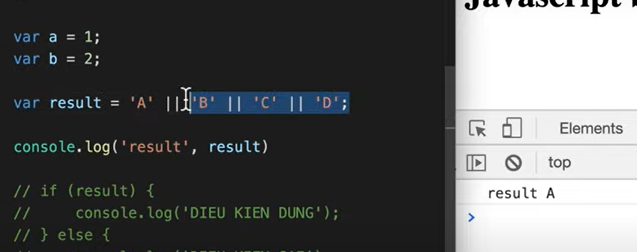

### Monday, 12/8/2024

### Introduction

- Javascript? Javascript to program the behavior of web pages
- Built-in function? Built-in function của javascript là hàm đã được xây dựng trước

---

### Quick Executor:

- Comment: // `/**/`
  - Ctrl + /
  - `/**`

---

### Distinct

1. set interval vs set timeout
2. toán tử == vs === hay != vs !==
   
   - ==: chỉ so sánh value
   - !==: cả value và type

---

### Biến

- Có phân biệt hoa thường
- var
- Không bắt buộc ;
- Built-in function: Alert, console, confirm, prompt, set timeout, set interval

---

### Toán tử

- Toán tử số học
  - Toán tử + khi cả 2 về đều là số
- Toán tử gán
  
- Toán tử so sánh
- Toán tử logic
- Toán tử nối chuỗi

---

### Kiểu dữ liệu

1. Nguyên thuỷ: Primitive Data

- Number
- Boolean
- String
- Undefined
- Null
  - typeof Null ra object
- Symbol (có tính unique)
- tạo vùng nhớ lưu và không thể thay đổi vùng nhớ

2. Phức tạp: Complex Data

- tạo ra vùng nhớ thực thi
- Function
- Object

---

### Truthy và Falsy?

1. Truthy - to bool is true
2. Falsy - to bool is false:

- Có 6 giá trị sau
  - false
  - 0
  - '' or ""
  - null
  - undefined
  - NaN

3. document.all: Ngoại lệ duy nhất

- !!document.all
  > false
  > -> document.all is false
- document.all khi chuyển sang boolean sẽ là false
- document.all khi là toán tử hạng của so sánh === hoặc !== sẽ là undefined
- typeof document.all sẽ trả về undefined
- Toán tử logical
  
  -> nếu khác giá trị falsy bỏ qua
  
  -> nếu có truthy thì lấy luôn
  - nếu vòng if thì sẽ trả về true/false
