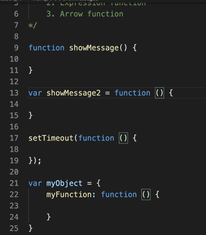

### Khái niệm?

1. Khái niệm

- Khối mã
- Làm việc cụ thể

2. Loại hàm

- Built in
- Tự định nghĩa

3. Tính chất

- Không thực thi khi định nghĩa
- Sẽ thực thi khi được gọi
- Có thể nhận về tham số
- Có thể trả về 1 giá trị

---

### Tham số

1. Định nghĩa

- Là giá trị có thể truyền vào khi gọi đến 1 function (trong định nghĩa)
- Khi gọi đến 1 function truyền vào giá trị thì gọi đó là đối số

2. Kiểu dữ liệu
3. Tính private

- Biến tham số trong hàm chỉ sử dụng được trong hàm

4. 1 tham số/ Nhiều tham số

- nếu biến không được truyền đối số -> undefined

5. Arguments?

- for of
- arguments là tất cả các đối số được truyền vào

4. Một số điều cần biết

- function trùng tên: ghi đè
- khai báo biến trong hàm: tính private
- đinh nghĩa hàm trong hàm: tính private

5. Các loại hàm:

- Declaration: từ khoá function đứng đầu, bắt buộc phải đặt tên
  - Hoisting: hàm được đưa lên đầu, có thể gọi hàm trước khi được định nghĩa
- Expression: gán cho 1 biến, hoặc trong setTimeout, trong object
  - Không Hoisting
    
- Arrow

---

# Sring

1. Length
2. Find index

- indexOf
- có thể truyền 2 tham số: chuỗi và vị trí bắt đầu tìm kiếm
- lastindexOf
- search: hỗ trợ tìm kiếm
  - có hỗ trợ tìm kiếm theo biểu thức chính quy
  - không có tham số thứ 2

3. Cut string

- slice
  - 2 tham số (start, end): vị trí cắt
  - để cắt toàn bộ: truyền 1 ts 0
  - số âm: cắt từ phải sang trái

4. Replace

- replace
  - 2 tham số
  - để ghi đè tất cả :/''/g
    -> để vào biểu thức chính quy

5. Convert to upper case

- toUpperCase: đổi tất cả thành hoa

6. Convert to lower case: hoa -> thường
7. Trim

- bỏ khoảng trắng thừa 2 đầu

8. Split

- cắt chuỗi -> mảng
- split('')-> truyền điểm chung để cắt vào
- để cắt tất cả các từ thành phần tử trong mảng, truyền '' vào split

9. Get a character by index

- từ index cho trước có thể lấy ra ký tự tương ứng
  charAt()-> truyền index
- cách 2 myString[]-> truyền index
- sự khác nhau: nếu không có ký tự: dùng cách 1 trả về null, cách 2 trả về undefined

---

# Number

- Number
  - .isFinite(): xác định giá trị có phải là số hữu hạn?
  - .isInteger(): có phải số nguyên?
  - .parseFloat(): chuyển chuỗi đã cho thành dấu phẩy động
    - '34 56 78'
      > 34
    - ' 37 '
      > 37
    - '18 is my age'
      > 18
  - .parseInt(): chuyển chuỗi đã cho thành số nguyên
  - .prototype.toFixed(): chuyển đỗi và trả về chuỗi đại diện cho số đã cho , có số chữ số chính xác sau dấu thập phân
    - var numberObject= 1234.56789
    - numberObject.toFixed()
      > 1235
  - prototype. toString: chuyển đổi và trả về số đã cho dưới dạng chuỗi

---

# Mảng (array)

- Kiểu dữ liệu: có thể đưa bất kỳ kiểu dữ liệu nào vào
- dùng từ khoá new với object Array, nó sẽ tạo instance, mất thời gian hơn
- type of Array = object
  -> để phân biệt với Object -> dùng Array.isArray

### Làm việc với mảng: (Key: Javascript array method)

1. To string

- toString()
  -> chuyển array về string (các phần tử sẽ ngăn cách bởi dấu ,)
  - muốn thay đổi dấu , thành dấu khác
    -> không dùng toString, dùng join() -> thêm dấu ngăn cách vào tham số

2. Join
3. Pop

- xoá phần tử cuối
- nếu hết phần tử để xoá, trả về undefined

4. Push

- thêm phần tử vào cuói mảng
  -> trả về độ dài mảng

5. Shift

- xoá phần tử từ đầu
  -> trả về độ dàin

6. Unshift

- thêm phàn tử đầu mảng -> trả về độ dài

7. Splicing

- truyền 2 tham số: vị trí xoá từ, số phần tử xoá
- có thể đùng để chèn
- truyền 3 tham số: vị trí sẽ chèn, số phần tử xoá, phần tử chèn vào

8. Concat
9. Slicing: Cắt

- truyền tham số: vị trí bắt đầu, vị trí kết thúc
- slice(0): copy mảng
- slice (1): copy từ 1 tới cuối
- có thể lấy ngược

---

# Object?

- là cấu trúc dữ liệu cho phép lưu trữ các cặp key-value
- có thể thêm key mới: string.key=''
- có thể xoá key: delete.key
- để trong [] với key như my-email
- this

### Object constructor:

- Bảng thiết kế
- Viết hoa chữ cái đầu theo quy ước
- object có thể biết được chính object constructor trong constructor (trong protype)
- có thể thêm key riêng lẻ cho các đối tượng, mà không bị ảnh hưởng gì đến nhau

### Object prototype

- nguyên mẫu
