- sử dụng javascript với html
  
- thuật ngữ built-in là gì? Hàm được xây dựng sẵn
  Giới thiệu một số hàm built-in
  1. Alert
  2. Console
  3. Confirm
  4. Prompt
     
  5. Set timeout
     
  6. Set interval
     Viết tương tự setTimeout
     Khác với setTimeout: là setInterval thực thi liên tục

---

### 25/7/2024

### 26/7/2024

### Làm quen với toán tử

1. Toán tử số học
   `+` Cộng
   `-` Trừ
   `*` Nhân
   `**` Luỹ thừa
   `\` Chia
   `%` Chia lấy số dư
   `++` Tăng giá trị số dư
   `--` Giảm giá trị số
2. Toán tử gán
   
3. Toán tử so sánh
   
   - So sánh == và ===
     - == chỉ quan tâm đến value (1=='1')
     - === so sánh value và datatype
4. Toán tử logic

- &&
- ||
- !

5. Toán tử nối chuỗi

- VD:
  const firstName='Son'
  const lastName='Dang'
  console.log(firstName+' '+lastName)

---

1. Kiểu dữ liệu Boolean
2. Câu lệnh điều kiện if-else
3. 6 giá trị convert sang boolean bằng false

- 0
- false
- Chuỗi rỗng ('' hoặc "")
- undefined
- NaN
- null

---

Kiểu dữ liệu trong Javascript

1. Dữ liệu nguyên thuỷ

- Number
- String
- Boolean
  - cách để thêm các kí tự đặc biệt vào chuỗi
    "Son \"Dang" -> Kết quả Son "Dang
- Undefined
- Null
- Symbol
  - Đặc tính: tính unique

2. Dữ liệu phức tạp

- Function
- Object

> Để kiểm tra kiểu dữ liệu, dùng type of

- đối với null, type of null sẽ ra object
- kết quả của type of luôn là 1 chuỗi

3. Truthy và Falsy là gì?

- Truthy - to bool is true: bất cứ giá trị nào trong JS mà khi chuyển đổi sang kiểu dữ liệu boolean mà có giá trị true, ta gọi giá trị đó là Truthy
  console.log(Boolean(1)) // true
  console.log(Boolean(['BMW'])) // true
  console.log(Boolean({ name: 'Miu' })) // true

  console.log(!!'hi') // true

  - Thêm !! ở trước các giá trị truthy luôn trả về true
    console.log(!!1) // true
    console.log(!!'f8') // true
    console.log(!!['Mercedes']) // true

- Falsy - to bool is false
  - Trong JS có 6 giá trị được coi là Falsy
    1. false
    2. 0
    3. '' hoặc ""
    4. null
    5. undefined
    6. NaN
  - Ngoài ra đều là Truthy
    > [] {} ... cũng là truthy
- Ngoại lệ document.all
  1.  document.all chuyển sang boolean sẽ là false
  2.  document.all khi là toán hạng của toán tử so sánh == hoặc != sẽ là undefined
  3.  Khi typeof document.all sẽ trả về "undefined"

---

### Hàm

1. Khái niệm hàm (function)

- Một khối mã
- Làm một việc cụ thể

2. Loại hàm

- Built in
- Tự định nghĩa

3. Tính chất

- Không thực thi khi định nghĩa
- Sẽ thực thi khi được gọi
- Có thể nhận tham số
- Có thể trả về 1 giá trị

* Tham số? Đối số?

---

### Tham số

1. Tham số

- Định nghĩa: số mà có thể truyền vào khi gọi đến 1 function
- Kiểu dữ liệu
  - Dùng type of
- Tính private
- 1 tham số
- Nhiều tham số

2. Truyền tham số

- 1ts
- Nhiều ts

3. Arguments

- Đối tượng arguments
  
- Giới thiệu vòng for
  -> làm việc với arguments
  Ví dụ:
  

4. Từ khoá return trong hàm
5. Một số điều cần biết về function

- Khi 2 function đặt trùng tên: function định nghĩa sau sẽ ghi đè
- Khai báo biến trong hàm
  - 1 biến khai báo trong phạm vi function có tính private, bên ngoài không truy cập được
- Định nghĩa hàm trong hàm
  

6. Các loại function:

- Declaration function
  Khi định nghĩa,
  function showMessage(){

}

- Expression function
  const showMessage= function(){}

  setTimeout(function(){})//truyền tham số trong hàm

  var myObject={
  myFunction: function(){}
  }

  - Đặt tên function sẽ giúp code dễ hiểu hơn

- Arrow function

* Sự khác nhau giữa declaration function và expression function:hoisting
  Declaration function gọi được trước khi được định nghĩa
  Expression function không gọi được trước khi được định nghĩa

---

### 27/7/2024

# 29/7/2024

### Chuỗi trong JS

1. Tạo chuỗi
   - Cách tạo chuỗi: 2
     - var fullName='Kim Cam'
       -> hay dùng hơn, nhanh hơn
     - var fullName= new String ('Son Dang')
       -> Kiểu dữ liệu tạo ra là Object
2. Một số case sử dụng backslash (\)
3. Xem độ dài chuỗi:
   .length
4. Chú ý độ dài khi viết code

- dùng toán tử nóio chuỗi để dễ quan sát
  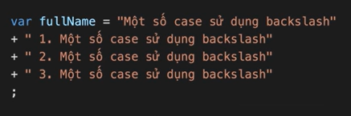

5. Template string ES6
   `Toi la: {firstName} {lastName}`

- truyền biến vào trong chuỗi, nếu biến không phải kiểu string tự convert thành string

6. Làm việc với chuỗi (Javascript string medthod)
   ...
   myString='Hoc JS tai F8!';

   1. Length
      myString.length-> in ra độ dài chuỗi
   2. Find index
      myString.indexOf('JS')-> trả về 4; -1 khi không tìm thấy
      myString.indexOf('JS',6)-> để lấy JS sau vị trí 6
      myString.lastIndexOf('JS')-> vị trí cuối cùng của chuỗi JS này (tìm từ sau lên)

      - search: giống index, nhưng không hỗ trợ indexOf phương thức 2, hỗ trợ tìm kiếm theo biểu thức chính quy

   3. Cut string
      myString.slice(4,6)-> Kq:JS, truyền 2 tham số: bắt đầu và kết thúc
      - (4)-> sẽ cắt từ 4 trở về cuối
      - (-3,-1)-> cắt từ trái sang phải
   4. Replace
      myString.replace('JS','Javascript')-> Kq: Hoc Javascript tai F8!
      -> nó chỉ thay đổi chữ JS đầu tiên tìm được
      -> để thay thế tất cả, ta dùng biểu thức chỉnh quy:
      myString.replace(/JS/g,'Javascript')-> Thay thế tất cả chuỗi `JS` tìm được
   5. Convert to upper case
      myString.toUpperCase()-> thường thành hoa
   6. Convert to lower case
      .toLowerCase()-> hoa thành thường
   7. Trim

   - dùng bỏ khoảng trắng
     myString.trim()

   8. Split
      var languages='Javascript, PHP, Ruby'

   - tách ra thành mảng gồm 3 môn học trên
     languages.split(', ')-> tách với điểm chung `, `
     languages='Javascript'
   - muốn tách ra thành từng chữ cái thì:
     languages.split('')

   9. Get a character by index

   - từ 1 chữ cái cho trước ta có thể lấy ra ký tự ở vị trí index
     const myString2='Son Dang'
     myString2.charAt(2)-> có index thì ra kí tự, không có thì trả về chuỗi rỗng
     - khác: nếu dùng myString2[n] mà n không tồn tại thì nó trả về undefinded

---

### Kiểu dữ liệu số (number)

1. Trong JS có 2 loại số

- 1. Các số thông thường tróng được lưu trữ dưới dạng 64 bit IEEE-754 (còn đgl các số phẩy động). Trong hầu hết các trường hợp làm việc với JS ta sử dụng các loại số này.
- 2. Số BigInt là loại số để biểu thị số nguyên có độ dài tuỳ ý

2. Cách khai báo
   var million =10000;
   var billion=1e6;

3. Đối tượng Number

- là đối tượng giúp định nghĩa số và làm việc với số.
- một số phương thức của đối tượng Number
  

Number.isFinite(2 / 0); // false
Number.isFinite(20 / 5); // true
Number.isFinite(0 / 0); // false

Number.isInteger(999999999); // true
Number.isInteger(0.2); // false
Number.isInteger(Math.PI); // false

Number.parseFloat('10') // 10
Number.parseFloat('10.00') // 10
Number.parseFloat('238,21') // 238
Number.parseFloat('237.22') // 237.22
Number.parseFloat('34 56 78') // 34
Number.parseFloat(' 37 ') // 37
Number.parseFloat('18 is my age') // 18

Number.parseInt('10') // 10
Number.parseInt('10.00') // 10
Number.parseInt('238,21') // 238
Number.parseInt('237.22') // 237
Number.parseInt('34 56 78') // 34
Number.parseInt(' 37 ') // 37
Number.parseInt('18 is my age') // 18

var numberObject = 1234.56789;

numberObject.toFixed(); // '1235'
numberObject.toFixed(1); // '1234.6'
numberObject.toFixed(6); // '1234.567890'

(11).toString(); // '11'
(18).toString(); // '18'
(17.3).toString(); // '17.3'

---

### Số và làm việc với số

1. Cách tạo
   var age=18;//popular
   var otherNumber = new Number(9);//object

- dùng typeof để kiểm tra.

2. Giá trị NaN

- Lưu ý: Trong JS, kiểu của NaN cũng là number
  var result =20/'ABC'
  -> console.log(result)-> kq:NaN
  -> kiểm tra isNaN(result)

3. Làm việc với Number

- To String
  myString.toString()
- To Fixed
  PI.toFixed()
  - nếu không có tham số mặc định là 0

---

### Mảng (array)

1. Tạo mảng

- Cách tạo
- Mảng có thể chứa bất kì kiểu dữ liệu nào: undefined, null, function
- mảng có 2 cách tạo:
  var languages=['JS', 'Ruby']
  var languages= new Array(
  'Javascript',
  null
  )//không thường dùng, do nó tạo instance

* typeof của array là 1 object
  -> để phân biệt array với object:
  Array.isArray(languages)

2. Truy xuất mảng

- Truy xuất mảng:
  languages.length
- Lấy phần tử theo index

---

### Làm việc với mảng

Keyword: Javascript array methods

var languages=[
'Javascript',
'PHP',
'Ruby'
]

1. To string
   
   -> nó tự có dấu , để ngăn cách. Có thể dùng join '' để bỏ dấu ,
   Tương tự thay các dấu ngăn cách nếu muốn với join.
2. Join
   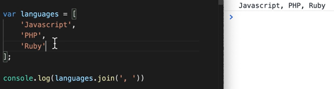
3. Pop

- xoá phần tử cuối mảng, và trả về phần tử đã xoá
  languages.pop()//xoá element
  //cuối mảng trả về phần tử đã xoá
  -> kq: Ruby. Mảng còn 2 phần tử
- xoá mà không có thì sẽ trả về undefined

4. Push

- thêm 1 hoặc nhiều phần tử vào cuối mảng, trả về độ dài mảng mới
  languages.push('Dart', 'Java')

5. Shift

- xoá đi phần tử đầu mảng và trả về phần tử đã xoá
- xoá mảng rỗng trả về undefined

6. Unshift

- thêm 1 hoặc nhiều ptu vào đầu mảng, trả về độ dài mới

7. Splicing

- xoá
  languages.splice()
  - ts1: truyền chỉ mục ban đầu (start)
  - ts2: deleteCount, số lượng element muốn xoá
    splice(1,0) nếu tham số thứ 2 là 0 thì sẽ không xoá
    splice(1,0,'Dart'): chèn Dart sau Javascript, trước 'PHP'
    splice(1,1,'Dart'): chèn Dart sau Javascript, chèn đè vào vị trí của phần tử số 1 'PHP'

8. Concat

- giúp nối array
  var languages2=[
  'Dart',
  'Ruby'
  ]
  languages.concat(languages2)

9. Slicing

- cắt toàn bộ hoặc 1 vài element, trả về phần cắt
- có 2 ts: start, end. Có thể lấy `ngược`
- cắt hết mảng: slice(0)

---

# Object

---

1. Object là gì?
   var myInfo={
   name:'Kim Cam',
   'age':21
   }
   - Thêm key mới
     
   - Cách thêm key có dấu -
     
   - Lấy value ra ngoài:
     myInfo.name -> ngắn gọn, dễ nhìn hơn
     Hoặc
     myInfo['name']
     -> Một key không có sẽ trả về undefinded
   - Cách thêm key là biến
     var myInfo={
     name:'Kim Cam',
     'age':21,
     [emailKey]: 'caothikimcam65@gmail.com'
     }
   - cách xoá key
     delete myInfo.name
   - có thể lưu function trong object
     var myInfo={
     name:'Kim Cam',
     'age':21,
     getName: function(){
     return this.name;
     //=return myInfo.name;
     }}
     > myInfo.getName()
   - key là hàm, ta gọi đó là phương thức(method), trường hợp còn lại ta gọi là thuộc tính (property)
2. Object constructor

- Bản thiết kế sẵn
- Quy ước chung, viết hoa chữ cái đầu
  
  - this này miêu tả các thuộc tính và phương thức sẽ có cho đối tượng khi khởi tạo từ object constructor này
  - this trong phương thức: this trong method gọi đến đối tượng
- cách xem lại constructor từ 1 đối tượng
  
- thêm thuộc tính riêng của các đối tượng
  
- thêm phương thức
  
- Có thể tạo bằng declaration hoặc expression function đều được
- Giúp đơn giản, tiện hơn

3. Object prototype (cơ bản)

- đối tượng nguyên mẫu: nguyên mẫu để tạo nên 1 đối tượng
- khi dùng this để định nghĩa object constructor thì phải thêm bên trong; còn với object prototype thì có thể thêm bên ngoài
  
  -> giúp thêm thuộc tính bên ngoài hàm tạo-> nó sẽ nằm trong prototype
- Khi thêm phương thức = object prototype gần giống thêm trong object constructor:
  
  - nếu thêm = object prototype, chỉ khi là phương thức mới lấy được được qua this
  - tất cả object được tạo ra sẽ đều được kế thừa

4. Đối tượng Date
   var date = new Date()
   

> Keyword: javascript date object mozilla

5. Đối tượng Math

- lưu ý: đây không phải constructor
  -> truy xuất thuộc tính, phương thức qua dấu .
- Math.PI
- Math.round(): làm tròn số
- Math.abs(-4): 4, giá trị tuyệt đối
- Math.ceil(4.00001):5, làm tròn trên
- Math.floor(): làm tròn dưới
- Math.random()
  
- Math.min(1,100,-100): -100
- Math.max(1,100,-100):100

---

### Lệnh rẽ nhánh, toán tử 3 ngôi

1. If else
2. Switch
3. Toán tử 3 ngôi
   c = a > 0 ? a : b;

---

### 30/7

### Vòng lặp

1. for - Lặp với đk đúng
2. for/in - Lặp qua key của đối tượng

- dùng lấy ra những key của những đối tượng
  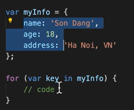
  - Mỗi lần chạy nó sẽ lấy ra key dưới dạng chuỗi:
    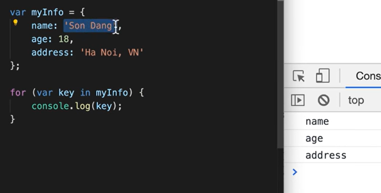
    -> truyền key vào có thể lấy ra value luôn
  - có thể tách 1 từ ra nhiều chữ cái
    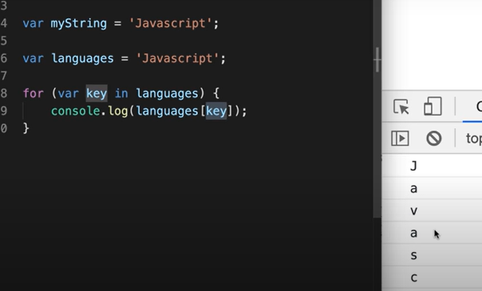

3. for/of - Lặp qua value của đối tượng

- ứng dụng với mảng: để lấy value
  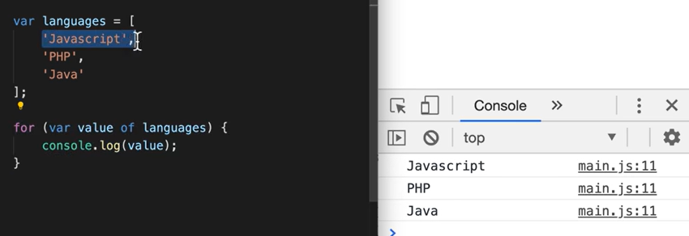
- cũng có thể lấy ký tự chuỗi như for/in
- đối với đối tượng: -> đổi thành mảng
  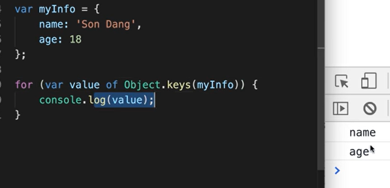
  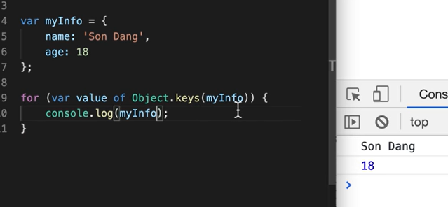
  - Cách 2:
    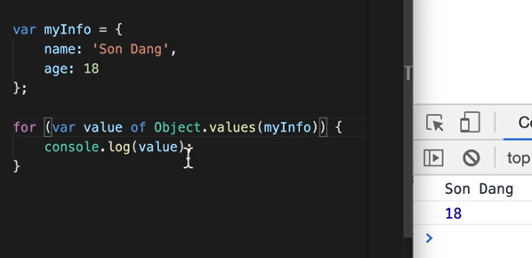

4. while - Lặp khi điều kiện đúng

5. do/while - Lặp ít nhất 1 lần, sau đó lặp khi điều kiện đúng
   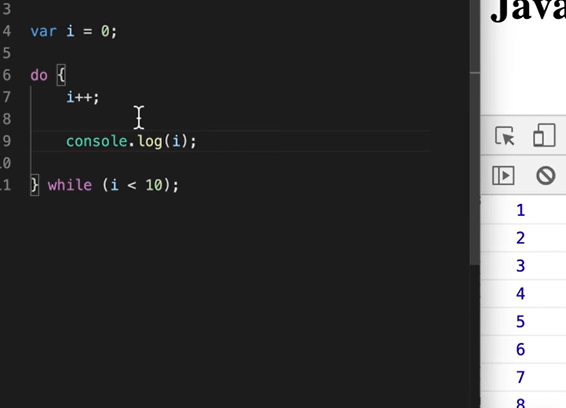

---

1. Break và continous

- Break nếu muốn thoát khỏi vòng lặp
- Continous nếu muốn bỏ qua 1 vài vòng của vòng lặp

2. Vòng lặp lồng nhau (Nested Loop)

3. Đệ quy

- Đệ quy là hàm tự gọi lại chính nó
- Cách giải quyết bài toán: Cho mảng 1, 2 loại bỏ các phần tử trùng lặp của mảng 1 và 2
  - Cách 1: Dùng Set (mỗi phần tử unique)
    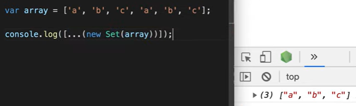
- Ví dụ dùng đệ quy:
  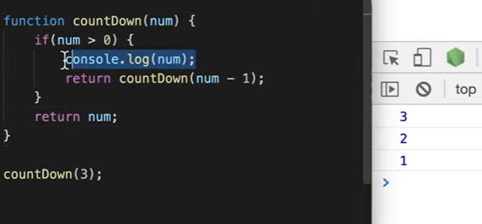
- Ví dụ dùng đệ quy tính giai thừa:
  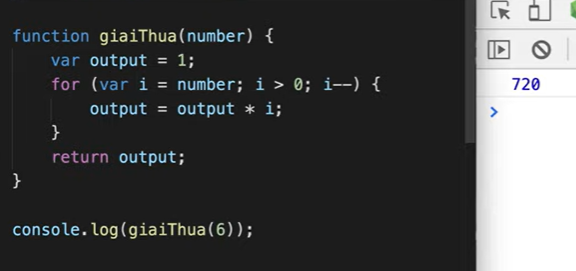
  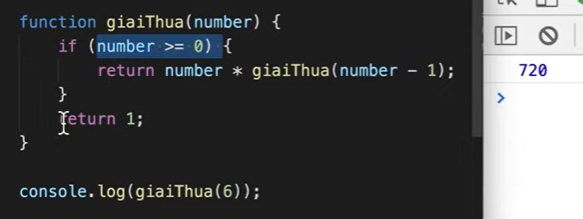

---

### Làm việc với mảng - Phần 2

1. forEach()

- duyệt qua từng phần tử của mảng
- truyền 1 hàm qua tham số (đgl callback)
  myArray.forEach(function(){

});
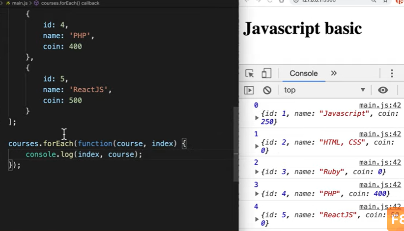

2. every()

- hữu ích khi muốn kiểm tra `tất cả` các phần tử của mảng phải thoả mãn điều kiện gì đó.
  -> trả về kiểu Boolean
  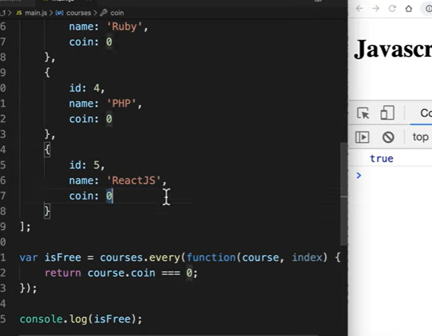

3. some()

- chỉ cần 1 phần tử trong mảng đúng thì sẽ trả về đúng

4. find()

- trả về chính phần tử đó nếu tìm được, return chỉ trả về 1 phần tử
  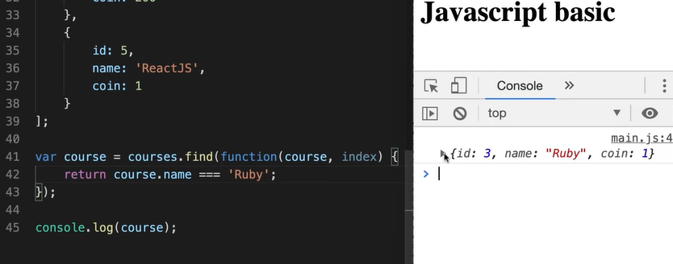

5. filter()

- trả về các phần tử thoả mãn điều kiện
  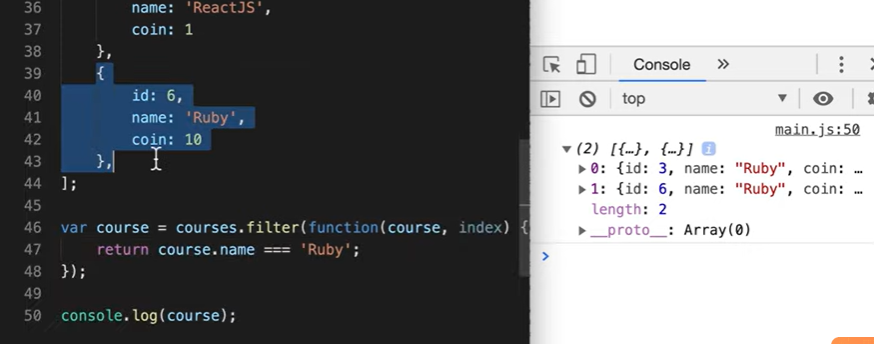
  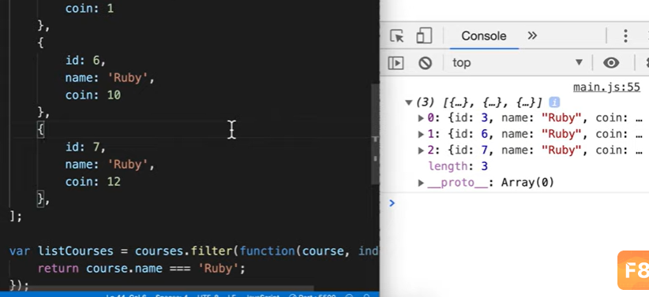

6. map()

- khi muốn thay đổi các element của 1 array
- sẽ trả về số lượng phần tử bằng ban đầu
- trong map này nó đang thực hiện vòng lặp, mỗi khi lặp nó gọi lại 1 function được truyền vào
  - Khi không truyền gì vào hàm
    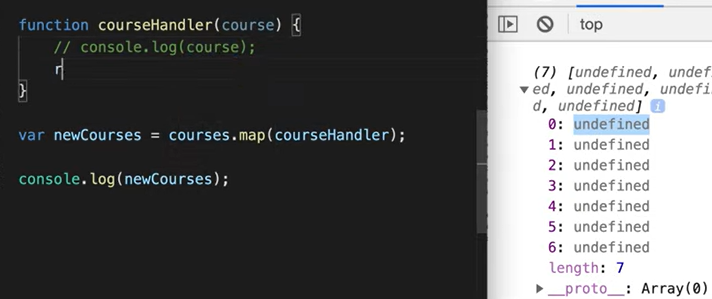
- Bài toán: giả sử khi ta muốn thêm trường coinText cho tất cả, thêm 'Khoa hoc' trước name
  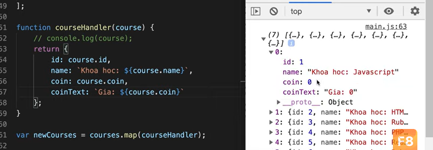
- ngoài ra có thể truyền index
  
- ngoài ra còn có thể trả về originArray
  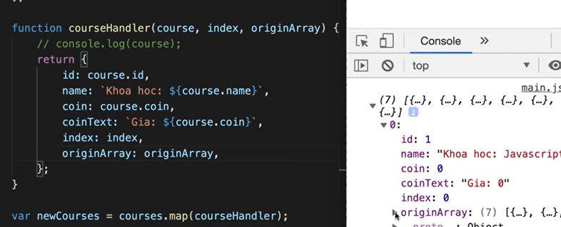
- Ví dụ: render chỉ lấy course name
  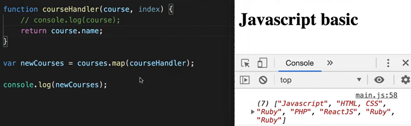

7. reduce()

- Mong muốn nhận về 1 giá trị duy nhất
  - Ví dụ muốn nhận về tổng số coin
    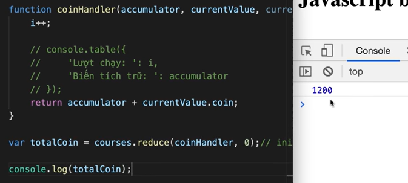
    - Kiểm tra cụ thể hơn:
      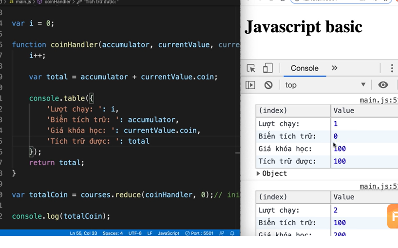
    - Cách viết ngắn gọn hơn và dùng arrow function:
      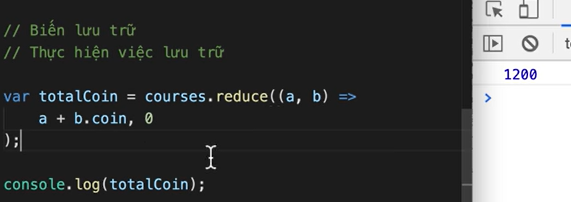
  - Nếu không dùng reduce, ta có thể dùng vòng lặp
  - Tham số truyền vào: function, biến lưu trữ (accumlator)...
    function coinandler(accumlator, currentValue, currentIndex, originArray){}
  - Biến lưu trữ là accumlator, lần đầu truyền bao nhiêu thì accumlator lần đầu sẽ có giá trị đó, các lần sau nó nhận giá trị return của hàm
  - currentValue theo đúng currentIndex
- Trong hàm reduce, tham số thứ 2 sau hàm callback là initialValue

### 2/8/24

---

### Ví dụ reduce() method

- InitialValue là tham số không bắt buộc
  - Tuy nhiên khi không có initialValue thì nó sẽ lấy giá trị đầu tiên làm giá trị khởi tạo, currentValue vòng đầu sẽ là phần tử thứ 2 (giảm đi 1 vòng chạy của function)
    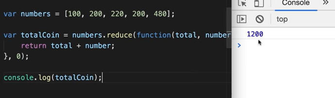
  - Không phải bài toán nào cũng có thể bỏ đi tham số initialValue (điển hình như bài toán trước tính tổng, ta cần dữ liệu number chứ không phải object)
- Thực tế, mong muốn nhận được kiểu dữ liệu gì thì ta đặt initialValue bằng kiểu đó
- Flat - "Làm phẳng" mảng từ Depth array - "Mảng sâu"
  var depthArray=[1,2,[3,4],5,6,[7,8,9]]
  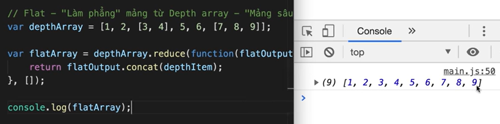
- Lấy ra các khoá học đưa vào mảng mới
  - Đề:
    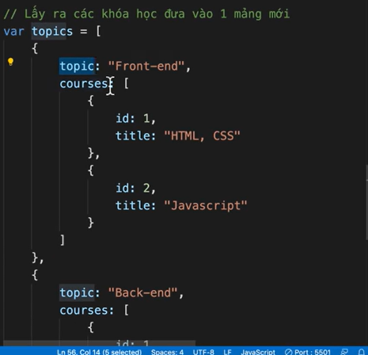
  - Cách giải: tương tự bài trên
    
- Tự tạo ra phương thức reduce
  - Reduce nhận 2 đối số: callback (bắt buộc), initialValue
  - Để định nghĩa phương thức mới cho Array:
    Array.prototypes.reduce2
    - khi không truyền initialValue
      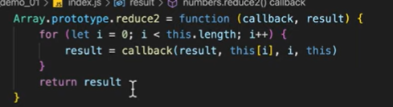
    - truyền initialValue: kiểm tra tham số truyền vào (= cách dùng arguments)

---

### String/ Array includes() method

- Ví dụ cơ bản sử dụng với chuỗi
  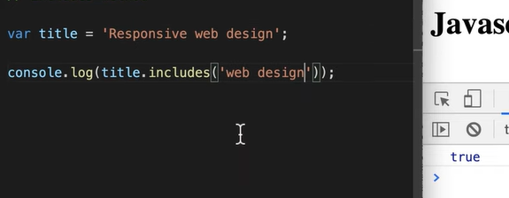
- Ví dụ sử dụng với array
  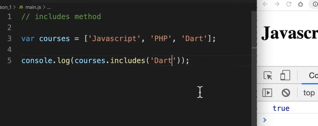
- Có đối số thứ 2: vị trí bắt đầu tìm kiếm từ
  - Khi truyền đối số là số âm (ví dụ -1): nó sẽ tìm từ length + (-1), (-1) là số truyền vào

---

# Callback?
