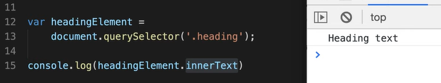
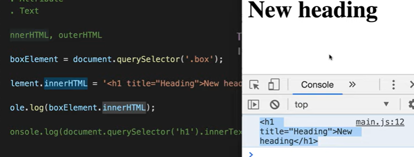

# HTML DOM

# 3/8/24

---

### Khái niệm

- Mô hình DOM:
  
- DOM (Document Object Model)
- Có 3 tp:
  - Element (cứ là thẻ tag)
  - Attribute (nằm trong thẻ đóng mở)
  - Text (văn bản)

---

### HTML DOM vs DOM API

- HTML DOM: quy chuẩn tài liệu HTML
- Javascript chỉ cung cập bộ phương tiện để có thể truy xuất vào HTML DOM
- DOM không thuộc Javascript

---

### Document object

- document.write('HELLO GUYS'): ghi vào 1 chuỗi
  

---

### Get element methods

- Cách học nội dung mới
  - Overview -> Phân chia học trước, học sau
- get Element: ID, class, tag, CSS selector, HTML collection
  - ID='heading
    > document.getElementById('heading')
  - ClassName
    > document.getElementsByClassNames('heading')
  - tag
    > document.getElementsByTagNames('p')
  - css selector
    > document.querySelector('.heading') -> classname=heading
    > document.querySelectorAll()
    - Select như bình thường trong file css
  - html collection
    - document.forms -> để select các <form></form>
      ...
- Bài tập ví dụ
  
- Mở rộng
  - Từ 1 node, lấy các element thuộc node đó (tương tự, thay document = node)

---

### 4/8/24

---

### DOM attributes

- thêm attribute bên ngoài: dùng setAttribute
  
- có thể get attribute cả vừa thêm, cả sẵn trong html
  

---

### InnerText và textContent Property

- lấy nội dung text node nằm trong element node
- thay đổi nội dung
- sự khác nhau innerText và textContent
  - innerText: giống như những gì bạn thấy trong trình duyệt
    - là thuộc tính của element node
      
  - textContent: lấy nội dung trong HTML
    - thuộc tính của element node và cả text node
      
    - Do nó lấy nguyên bản cả khoảng trắng
  - Ví dụ:
    

---

### InnerHTML vs OuterHTML Property

- thêm element
  - sử dụng innerHTML
    
  - có thể getter nội dung đó: dùng innerHTML
    
- OuterHTML
  - Khi thêm: nó ghi đè lên chính nó
    
    -> Khi đó không thể get ra được nữa do đã ghi đè

---

### Node properties

- Tự học các phương thức, thuộc tính còn lại (id, className, innerText, innerHTML,...)
- console.log để xem các thuộc tính
  

---

### DOM CSS

- để xem các kiểu
  
- sử dụng css đứng từ element node
  
- bản thân style là 1 object

### ClassList Property

- .classList để xem và lấy ra
- thuộc tính của element node
- add: thêm class vào element
  - Có thể thêm multi class:
    
- contains: kiểm tra xem class có trong tại trong element này không
- remove: xoá class
  - nếu không có thì cũng không lỗi, không có gì xảy ra
- toggle: nếu gọi tới, nó có class thì nó sẽ xoá, nếu không có thì nó sẽ thêm

---

### DOM events

- sự kiện này là hành vi diễn ra của trình duyệt hoặc người dùng
  - 1. Attribute events
  - 2. Assign event using the element node
       
       - Trả về cho ta 1 mouseevent:
         
- Using element node

  - target trả về chính element ta click (hoặc sự kiện gì đó) vào

- sự kiện nổi bọt (con -> cha)
- bài: in ra 3 h1 khi click, click cái nào in ra cái đó
  
- nên viết ra file riêng, dễ dàng hơn (thay vì attribute events)

---

### DOM events example

1. Input/select

- Bản chất: sử dụng onchange
- Dùng trong xử lý form: text, checkbox...
- Sự kiện oninput (gõ đến đâu, in ra đến đấy)
- onchange lấy sau khi blur
- input cách query:
  
- checkbox:
  
- select:
  
  - ứng dụng:
    

2. Key up/down

- khi nhấn phím sẽ trả về KeyboardEvent
  
- lưu ý: nhấc lên mới lọt vào keydown
- giúp xử lý các bài toán:
  - khi thoát có thể nhấn esc: có thể focus document

---

### PreventDefault and StopPropagation (ngăn sự kiện nổi bọt)

### 9/8/24

### 10/8/24

1. preventDefault: loại bỏ mặc định của 1 thẻ

- ví dụ 1: có nhiều thẻ a (trang google, trang f8), chỉ trang href có f8 thì cho chuyển trang
  
- ví dụ 2: tìm kiếm, khi click vào thì nó mới hiển thị ra
  
  - Khi tìm kiếm, không thể click vào, vì khi click mất focus -> kết quả tìm kiếm bị ẩn đi -> sử dụng preventDefault
    

2. stopPropagation: ngăn sự kiện nổi bọt
   

---

### Event listener

- DOM event và Event listener xử lý những công việc như nhau
- Cách huỷ bỏ sự kiện trong DOM event bằng cách ghi đè
  
- Đối với event listener nó cung cấp nhiều hay hơn
  - đối số thứ nhất là sự kiện, đối số thứ 2 là function callback
    
  - có thể add thêm nhiều event
  - giúp không cần phải viết chung funtion, nhìn tường minh, dễ hiểu hơn
- Huỷ bỏ lắng nghe trong event listener: removeEventListener (phải tách callback ra để thêm và xoá callback)
  
