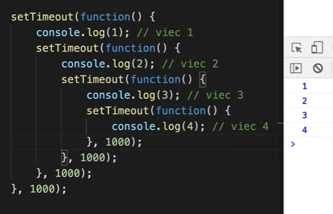

### 10/8/24

---

### JSON là gì

1. Javascript Objact Notation
2. Là 1 định dạng dữ liệu (chuỗi)

- Mang lại cách truyền tải dữ liệu nhẹ, cú pháp đơn giản
- Sử dụng trong tất cả các ngôn ngữ, do nó chỉ là 1 định dạng, không phải kiểu

3. JSON: Number, String, Boolean, Null, Array, Object
   -> có thể biến những kiểu này thành JSON và ngược lại

- Stringify (chuyển đổi sang bộ mã khác)
- Parse (dịch ngược lại)

---

### Promise (sync, async)

- Đồng bộ, bất đồng bộ?
  - Đồng bộ là cái nào viết trước chạy trước, viết sau chạy sau
  - JS xử lý đồng bộ, nhưng có những cái bất đồng bộ
    
- JS usually async: setTimeout, setInterval, fetch, XMLHttprequest, file reading, request animation
- Thao tác bất đồng bộ có thể xảy ra vấn đề, do đó ta học promise để xử lý vấn đề
  

---

1. Promise (pain)

- Promise: sinh ra để giải quyết những tác vụ mà phụ thuộc vào nhau
  Pain:

- Callback hell
  
- Pyramid of doom

2. Promise (concept)

- có trong ES6 -> giải quyết vấn đề callback hell -> thay thế callback nhưng không hoàn toàn
- Là object constructor (khi gọi new Promise trả về 1 đối tượng Promise được tạo ra từ object constructor promise)
- Khi gọi new Promise sẽ gọi excutor function thực thi ngay
- Executor có 2 tham số: resolve (giải quyết), reject (thất bại)
  
- Phải gọi resolve hoặc reject, nếu không gọi sẽ gây trạng thái treo -> gây memory leak
- promise có 3 phương thức thường dùng: then, catch, finally. Đều nhận callback. resolve được gọi: then được gọi; reject được gọi thì catch được gọi; finally được gọi cả khi resolve/reject được gọi.
- Promise có trạng thái:
  - 1. Pending: không gọi resolve/ reject
  - 2. Fulfilled: gọi resolve
  - 3. Reject

---

### Promise inclusion for interview

- Promise sinh ra để viết code không bị sâu, đọc dễ hiểu hơn, giải quyết vấn đề callback hell
- Để tạo ra 1 promise sử dụng từ khoá new với Promise, trong constructor của nó ta sẽ truyền 1 excutor function. Trong excutor function nhận được 2 tham số resolve khi thao tác xử lý thành công hoặc reject khi thất bại.
- Đối tượng promise được tạo ra ta sẽ sử dụng phương thức then, catch. Then khi promise được resolve và catch khi promise reject.
- Sử dụng trong những trường hợp ta xử lý thao tác bất đồng bộ.

---

### Promise (chain)

- tính chất chuỗi, nối nhau từng cái, có thể nhiều then nối nhau
  
- then 1 trả về cái gì thì then 2 nhận được cái đó, nếu không return then 2 nhận undefined.
- nếu không return promise, thì nó sẽ chạy then 2.
- nếu return một promise
  -> Phải chờ Promise này được giải quyết, mới chạy then 2.
  
  
  > Output: 1 2 3 4

---

### Promise methods (resolve, reject, all)

- khi đang thực hiện nhiều then mà có 1 promise bị reject thì nó sẽ không thực hiện các vòng then sau, nó sẽ chuyển qua catch
- promise all khi 2 promise chạy song song riêng lẻ, ta cần kết quả sau khi chạy hoàn tất của cả 2 promise
- vẫn có Promise hell -> chưa giải quyết hoàn toàn callback hell

---

### 14/8/24

### Fetch

- API?
- fetch
  - cách làm việc để gọi api
- JSON server
  - a full fake REST API
  - API Server (fake)/ Mock API
- Postman làm việc với REST API
