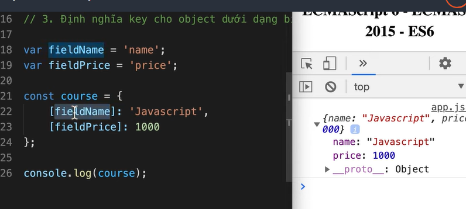

# ECMAScript6 - ECMAScript 2015 ES6

1. Khái niệm:

- là quy chuẩn ra đời bởi Ecma International
  -> tạo ra để tiêu chuẩn hoá Javascript

---

### Let, const

1. Scope
   {
   var course='Javascript basic!';
   }
   console.log (course)

- chỉ var không bị lỗi
  -> var phạm vi hàm
- let, const phạm vi khối (block)
- nếu khai báo hàm trong hàm, ưu tiên trong khối gần nhất

2. Hoisting

- là đưa lên trên
- var hỗ trợ hoisting
- let, const không có hỗ trợ hoisting

3. Assignment

- không thể sử dụng toán tử gán thứ 2 cho chính biến là constant

---

### Template literals

- dấu `${}` nội suy, đưa biến muốn nội suy vào trong này
- giữ đúng format khi viết (dấu enter...)

---

### Arrow functions

- hàm mũi tên
- arrow function không có context (nên dùng this sẽ là undefine)
  => arrow function không dùng tạo constructor functions

---

### Classes

- class User{
  constructor(name,age){
  this.age=age
  this.name=name
  }
  }
- default paremeter values
  - gán giá trị mặc định
  - trong những trường hợp có những tham số không bắt buộc để nhập

---

### Enhanced object literals

- giúp định nghĩa key, value cho object ngắn gọn hơn
  
- định nghĩa method cho object
  
- định nghĩa key cho object dưới dạng biến
  

---

### Destructuring, Rest

- là cú pháp cho phép trích xuất các giá trị từ mảng hoặc thuộc tính từ object và gán chúng vào các biến riêng biệt một cách ngắn gọn và dễ đọc hơn
  

- nếu lấy a, c mà không lấy b, dùng dấu , để ngăn cách
- để chỉ lấy b,c -> a,...rest
  -> rest=b,c

* Rest (toán tử còn lại)
* Spread (toán tử giải)

---

### Tagged template literals

- sử dụng function có thể gọi function đó qua cú pháp template literals
  

---

### Modules

- import/export
- thêm type="module" trong script của html để import
- name exports: có thể xuất nhiều giá trị từ 1 module. Khi import phải sử dụng đúng tên đã export
- export defaults: cho phép export 1 giá trị duy nhất từ module. Khi import, không cần sử dụng đúng tên như khi export.

---

### Optional chaining

- ?.
